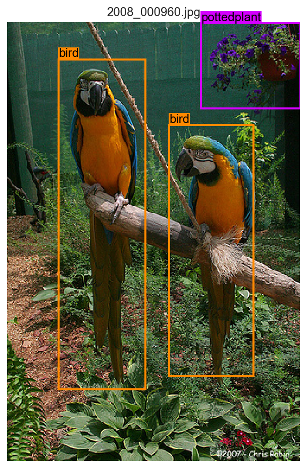
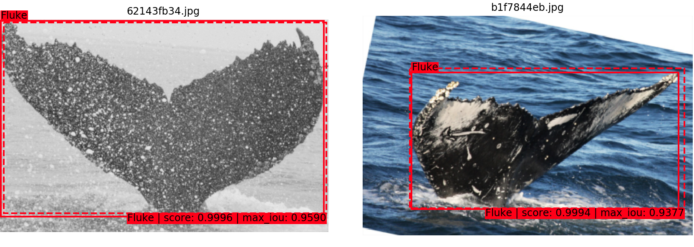
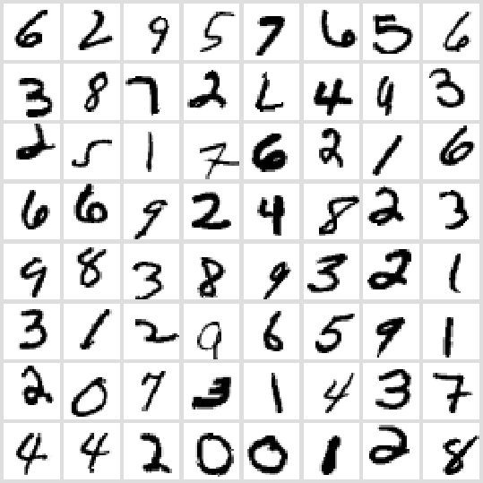

# Machine Learning
This repo contains a compilation of machine learning projects in the form of Jupyter notebooks. For some notebooks additional data, such as bounding box annotation files are needed, these files can be found in the *data* folder. [Pytorch](https://pytorch.org/) is used as the underlying library for projects involving deep learning.

## `mltools` Library
This is a small Python library which contains useful classes and functions for machine learning and data science tasks, such as for example functions helping with feature exploration and Dataset-classes for object detection and classification using Pytorch. 

## Notebooks

### Object Detection

#### VOCXMLDataset Demo ([notebook](https://github.com/mfl28/MachineLearning/blob/master/notebooks/VOCXMLDataset_Demo.ipynb), [nbviewer](https://nbviewer.jupyter.org/github/mfl28/MachineLearning/blob/master/notebooks/VOCXMLDataset_Demo.ipynb))

A notebook showcasing the use of the `VOCXMLDataset` class from `mltools.detection.datasets` using images and annotations from the [VOC2012 dataset](http://host.robots.ox.ac.uk/pascal/VOC/voc2012/) for demonstrations. 

#### Humpback Whale Fluke Detection ([notebook](https://github.com/mfl28/MachineLearning/blob/master/notebooks/Humpback_Whale_Fluke_Detection.ipynb), [nbviewer](https://nbviewer.jupyter.org/github/mfl28/MachineLearning/blob/master/notebooks/Humpback_Whale_Fluke_Detection.ipynb), [Google Colab](https://colab.research.google.com/github/mfl28/MachineLearning/blob/master/notebooks/Humpback_Whale_Fluke_Detection.ipynb))

A notebook showing how to perform object detection with a custom dataset using a pre-trained and subsequently fine-tuned neural network. Specifically, the aim is to detect and locate humpback whale flukes in images from the [Kaggle Humpback Whale Identification Challenge](https://www.kaggle.com/c/humpback-whale-identification). The ground truth bounding box labels for a selection of 800 images from the training dataset provided by the challenge were created using [Bounding Box Editor](https://github.com/mfl28/BoundingBoxEditor).

### Classification

#### Kaggle Competition: MNIST Digit Recognizer ([notebook](https://github.com/mfl28/MachineLearning/blob/master/notebooks/Kaggle_Mnist_Digit_Recognizer.ipynb), [nbviewer](https://nbviewer.jupyter.org/github/mfl28/MachineLearning/blob/master/notebooks/Kaggle_Mnist_Digit_Recognizer.ipynb))

A notebook showing how to train a convolutional neural network object classifier for the MNIST Dataset from the [Kaggle MNIST Digit Recognizer competition](https://www.kaggle.com/c/digit-recognizer). The aim is to predict hand-drawn digits in images as accurately as possible.

#### Kaggle Competition: Titanic - Machine Learning from Disaster ([notebook](https://github.com/mfl28/MachineLearning/blob/master/notebooks/Kaggle_Titanic_Machine_Learning_From_Disaster.ipynb), [nbviewer](https://nbviewer.jupyter.org/github/mfl28/MachineLearning/blob/master/notebooks/Kaggle_Titanic_Machine_Learning_From_Disaster.ipynb))

The aim of this notebook is to build a model which can predict the survival of passengers of the Titanic. Problem and data come from the [Kaggle Titanic: Machine Learning from Disaster competition](https://www.kaggle.com/c/titanic). We start with an exploration and visualization of the provided features, then proceed to building a feature engineering [Pipeline](https://scikit-learn.org/stable/modules/generated/sklearn.pipeline.Pipeline.html) using [scikit-learn](https://scikit-learn.org/stable/index.html). Finally we'll experiment with several machine learning approaches to solve the prediction problem.

